Tutorial de Transcriptômica Espacial (Xenium) - Introdução
================
Karla Oliveira
2026-09-03

- [0. Informações sobre esse
  Tutorial](#0-informações-sobre-esse-tutorial)
- [1. Setup](#1-setup)
  - [Instalação de pacotes](#instalação-de-pacotes)
  - [Carregamento dos pacotes](#carregamento-dos-pacotes)
- [2. Dataset](#2-dataset)
  - [Download](#download)
  - [Carregando o dataset pelo
    Seurat](#carregando-o-dataset-pelo-seurat)
  - [Conversão: parquet –\> csv](#conversão-parquet--csv)
  - [Estrutura de objetos Seurat](#estrutura-de-objetos-seurat)
  - [Codewords](#codewords)
  - [Definição de identidades](#definição-de-identidades)
  - [Carregando as medidas de segmentação
    celular](#carregando-as-medidas-de-segmentação-celular)
- [3. Análise Exploratória (QC)](#3-análise-exploratória-qc)
  - [Identificação de *Outliers* via
    MAD](#identificação-de-outliers-via-mad)
- [4. Pré-processamento: Filtro](#4-pré-processamento-filtro)
- [5. Processamento](#5-processamento)
  - [5.1 Normalização](#51-normalização)
  - [5.2 Redução de dimensionalidade](#52-redução-de-dimensionalidade)
    - [5.2.1 Principal Component Analysis
      (PCA)](#521-principal-component-analysis-pca)
    - [5.2.2 Uniform Manifold Approximation and Projection
      (UMAP)](#522-uniform-manifold-approximation-and-projection-umap)
  - [5.3. Vizinhos](#53-vizinhos)
  - [5.4. Clusterização](#54-clusterização)
- [6. Visualização Espacial e
  Marcadores](#6-visualização-espacial-e-marcadores)
  - [6.1 Visualização espacial](#61-visualização-espacial)
  - [6.2 Marcadores](#62-marcadores)
- [7. Informações Adicionais](#7-informações-adicionais)
- [8. Referências](#8-referências)

<style type="text/css">
body, p, li, td, th {
  font-family: -apple-system, BlinkMacSystemFont, "Segoe UI", Helvetica, Arial, sans-serif !important;
}
strong, b {
  font-weight: 700 !important;
}
</style>

``` r
knitr::opts_chunk$set(echo = FALSE, message = FALSE, warning = FALSE, dpi = 96)
```

# 0. Informações sobre esse Tutorial

- Este notebook apresenta um fluxo de trabalho inicial para análises de
  Spatial Transcriptomics a partir de dados da plataforma Xenium.
- As análises referem-se a uma amostra única de tecido neural murino
  (Subset CTX-HP).
- Quando mais de um dataset (amostra) está presente, é importante fazer
  a integração dos dados.
- Não são utilizadas ferramentas de anotação por referência como RCTD ou
  label transfer.

# 1. Setup

Antes de começar, vamos limpar o ambiente e definir o diretório de
trabalho.

``` r
# Limpa ambiente
rm(list=ls())

# Define diretório
setwd("/Users/karlaoliveira/Documents/Karla/Projects/Learning_Spatial_Transcriptomics/Class/")

# Set seed
set.seed(42)
```

## Instalação de pacotes

O tutorial requer os pacotes abaixo. Se não os tiver instalado,
descomente as linhas.

``` r
# if (!requireNamespace("BiocManager", quietly = TRUE)) install.packages("BiocManager")
# install.packages(c("Seurat",
#                    "sf",
#                    "tidyverse",
#                    "patchwork",
#                    "magrittr",
#                    "arrow",
#                    "clustree",
#                    "remotes", 
#                    "leidenbase"))
# BiocManager::install("glmGamPoi")
```

## Carregamento dos pacotes

``` r
library(Seurat)
library(sf)
library(tidyverse)
library(patchwork)
library(magrittr)
library(arrow)
library(clustree)
library(igraph)
library(leidenbase)
```

# 2. Dataset

## Download

- Faça o download do dataset de interesse e unzip os arquivos;
- Essa etapa é realizada uma única vez.
- Execute-a no terminal ou descomente o código abaixo caso deseje baixar
  via R.

``` r
# system("wget https://cf.10xgenomics.com/supp/xenium/analysis-workshop/one-sample-analysis.tar.gz")
# system("tar -xzvf ./one-sample-analysis.tar.gz")
```

## Carregando o dataset pelo Seurat

``` r
xenium.obj <- LoadXenium(
  data.dir = "Xenium_V1_FF_Mouse_Brain_Coronal_Subset_CTX_HP_outs/",
  fov = "fov",
  segmentations = "cell",
  flip.xy = TRUE
)

# Overview do objeto
xenium.obj
```

    ## An object of class Seurat 
    ## 541 features across 36602 samples within 4 assays 
    ## Active assay: Xenium (248 features, 0 variable features)
    ##  1 layer present: counts
    ##  3 other assays present: BlankCodeword, ControlCodeword, ControlProbe
    ##  1 spatial field of view present: fov

## Conversão: parquet –\> csv

Convertendo **.parquet** em **.csv.gz** (Se necessário)

A partir do Xenium Analyzer v3.0, alguns dados vêm no formato
**.parquet**. No Seurat v5.2.0+, o carregamento é direto. Para versões
anteriores, converta conforme o código abaixo, usando “arrow”.

``` r
cells         <- read_parquet("Xenium_V1_FF_Mouse_Brain_Coronal_Subset_CTX_HP_outs/cells.parquet")
cells$cell_id <- as.character(cells$cell_id)

cells_gz      <- gzfile("Xenium_V1_FF_Mouse_Brain_Coronal_Subset_CTX_HP_outs/cells.csv.gz", "w")

# Write the csv file and close it
write.csv(cells, file = cells_gz, row.names = FALSE, quote = FALSE)
close(cells_gz)
```

## Estrutura de objetos Seurat

O objeto **xenium.obj** segue a classe S4. Acessamos seus slots
(“compartimentos”) com o operador @.

``` r
slotNames(xenium.obj)
```

    ##  [1] "assays"       "meta.data"    "active.assay" "active.ident" "graphs"       "neighbors"   
    ##  [7] "reductions"   "images"       "project.name" "misc"         "version"      "commands"    
    ## [13] "tools"

``` r
glimpse(xenium.obj@meta.data)
```

    ## Rows: 36,602
    ## Columns: 10
    ## $ orig.ident               <fct> SeuratProject, SeuratProject, SeuratProject, SeuratProject, Seurat…
    ## $ nCount_Xenium            <dbl> 384, 146, 81, 314, 639, 270, 354, 97, 250, 495, 344, 326, 351, 424…
    ## $ nFeature_Xenium          <int> 96, 64, 48, 94, 97, 90, 88, 56, 72, 103, 103, 79, 79, 80, 91, 87, …
    ## $ segmentation_method      <chr> "cell", "cell", "cell", "cell", "cell", "cell", "cell", "cell", "c…
    ## $ nCount_BlankCodeword     <dbl> 1, 0, 0, 1, 1, 0, 0, 0, 0, 1, 0, 0, 0, 0, 1, 0, 0, 0, 0, 0, 0, 0, …
    ## $ nFeature_BlankCodeword   <int> 1, 0, 0, 1, 1, 0, 0, 0, 0, 1, 0, 0, 0, 0, 1, 0, 0, 0, 0, 0, 0, 0, …
    ## $ nCount_ControlCodeword   <dbl> 0, 0, 0, 0, 0, 0, 0, 0, 0, 0, 0, 0, 0, 0, 0, 0, 0, 0, 0, 0, 1, 0, …
    ## $ nFeature_ControlCodeword <int> 0, 0, 0, 0, 0, 0, 0, 0, 0, 0, 0, 0, 0, 0, 0, 0, 0, 0, 0, 0, 1, 0, …
    ## $ nCount_ControlProbe      <dbl> 0, 0, 0, 0, 0, 0, 0, 0, 0, 0, 0, 0, 0, 0, 0, 0, 0, 0, 0, 0, 0, 0, …
    ## $ nFeature_ControlProbe    <int> 0, 0, 0, 0, 0, 0, 0, 0, 0, 0, 0, 0, 0, 0, 0, 0, 0, 0, 0, 0, 0, 0, …

Perceba que, o metadado contém múltiplas informações. Mas antes de
entendê-las é preciso esclarecer uma coisa: os paineis do Xenium usam
**codewords**.

## Codewords

São uma espécie de “dicionário” atribuídas a cada um dos genes do
painel. Funcionam na seguinte estrutura:


Existem alguns pontos-chave nas *codewords*:

- **Negative control codewords**: são codewords que não possuem sondas
  correspondentes a esse código. São escolhidas para atender aos mesmos
  requisitos que os codewords regulares e podem ser usadas para avaliar
  a especificidade do algoritmo de decodificação;
- **Negative control probes**: são sondas presentes nos paineis e têm
  como alvo sequências não biológicas. Podem ser usadas para avaliar a
  especificidade do ensaio;
- **Genomic control probes**: são sondas projetadas para se ligar ao DNA
  genômico intergênico, mas não a nenhuma sequência de transcrito
  presente no tecido. Elas estão presentes no ensaio Xenium Prime;
- **Unassigned codewords**: são codewords não utilizados. Não há nenhuma
  sonda em um painel de genes específico que gerará o codeword;
- **Deprecated codewords (Blank)**: são atribuídas a codewords que não
  são usados no pipeline de análise embarcada Xenium.

Se você der uma nova olhada no metadado, perceberá as informações
seguintes:

- **nCount_Xenium**: número total de transcritos (moléculas de RNA)
  detectados por célula, somando todos os genes do painel;
- **nFeature_Xenium**: número de genes distintos (features) detectados
  por célula ou seja, quantos genes diferentes tiveram pelo menos 1
  transcrito naquela célula;
- **segmentation_method**: indica o método usado para definir os limites
  (boundaries) de cada célula — por exemplo, segmentação baseada em
  coloração de membrana/borda celular ou por expansão do núcleo
  (“nucleus expansion”). É importante porque afeta quantos transcritos
  “vazam” de células vizinhas para dentro da célula segmentada;
- **nCount_BlankCodeword** & **nFeature_BlankCodeword**: contagens de
  “blank codewords” — códigos de barras (barcodes) que existem no design
  do painel mas não estão atribuídos a nenhum gene real. Servem para
  estimar a taxa de falsos positivos por decodificação incorreta de
  sinal óptico;
- **nCount_ControlCodeword** & **nFeature_ControlCodeword**: similar ao
  anterior, mas para outra categoria de códigos-controle reservados pelo
  sistema (também não correspondem a genes reais);
- **nCount_ControlProbe** & **nFeature_ControlProbe**: contagens de
  sondas-controle negativas — sondas desenhadas para não hibridizar com
  nenhum RNA real, usadas para medir ligação inespecífica (background)
  das sondas no tecido.

## Definição de identidades

``` r
# Atribui id "MouseBrain" para uma coluna meta data
Seurat::Idents(object = xenium.obj) <- "MouseBrain" # Era "SeuratProject"

# Verifica as identidades dos transcritos gerando uma tabela
table(Idents(xenium.obj))
```

    ## 
    ## MouseBrain 
    ##      36602

## Carregando as medidas de segmentação celular

Aqui vamos carregar os arquivos “cell_area” e “nucleus_area”. Não é todo
experimento Xenium que contém esse módulo. Muitas vezes, a segmentação é
feita ao corar a lâmina após a corrida de transcriptômica espacial. Isso
fornece uma camada a mais de dificuldade que deve ser considerada nas
análises (e que não será abordada nesse breve tutorial).

``` r
cells_info <- read.csv("Xenium_V1_FF_Mouse_Brain_Coronal_Subset_CTX_HP_outs/cells.csv.gz")

rownames(cells_info) <- cells_info$cell_id
xenium.obj$cell_area <- cells_info[colnames(xenium.obj), "cell_area"]
xenium.obj$nucleus_area <- cells_info[colnames(xenium.obj), "nucleus_area"]
```

- **cell_area**: a área total (em µm²) da célula inteira, conforme
  delimitada pela segmentação — ou seja, o polígono/máscara que o
  algoritmo desenhou ao redor de toda a célula (membrana/citoplasma
  incluído).<br>
- **nucleus_area**: a área (em µm²) apenas do núcleo daquela mesma
  célula, delimitada por uma segmentação separada baseada na coloração
  de DNA (geralmente DAPI).

# 3. Análise Exploratória (QC)

As etapas a seguir constituem análise exploratória e são realizadas para
entendermos o que foi gerado pelo Xenium.

Primeiro, vamos plotar gráficos dos genes por célula (nFeature_Xenium),
transcritos por célula (nCount_Xenium), área das células segmentadas e a
razão núcleo/célula.

``` r
# Padrão de tema a ser aplicado aos plots dessa sessão, evitando repetição de código.
plot_pattern <- theme_set(
  theme_minimal() +
    theme(plot.title = element_text(size = 8)))

# Gráfico 1: Total de transcritos por célula
p1 <- ggplot(xenium.obj@meta.data, aes(x = nCount_Xenium)) +
  geom_histogram(binwidth = 100, fill = "steelblue", color = "black") +
  ggtitle("Total transcripts per cell") +
  plot_pattern

# Gráfico 2: Transcritos únicos por célula
p2 <- ggplot(xenium.obj@meta.data, aes(x = nFeature_Xenium)) +
  geom_histogram(binwidth = 10, fill = "#5F9EA0", color = "black") +
  ggtitle("Unique transcripts per cell") +
  plot_pattern

# Gráfico 3: Área das células segmentadas
p3 <- ggplot(xenium.obj@meta.data, aes(x = cell_area)) +
  geom_histogram(bins = 30, fill = "#FFB90F", color = "black") +
  ggtitle("Area of segmented cells") +
  plot_pattern

# Gráfico 4: Proporção núcleo/célula
p4 <- ggplot(xenium.obj@meta.data, aes(x = nucleus_area / cell_area)) +
  geom_histogram(bins = 30, fill = "#FF8C00", color = "black") +
  ggtitle("Nucleus ratio") +
  plot_pattern

# Combina os 4 gráficos em uma única linha
comb1 <- p1 + p2 + p3 + p4 + plot_layout(ncol = 4)

# Exibe
print(comb1)
```

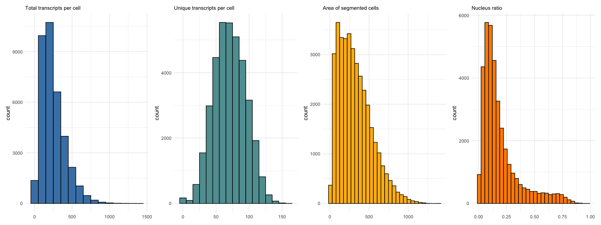<!-- -->

Quanto à razão **nucleus_area/cell_area**:

- Valor próximo de 1 (núcleo ocupando quase toda a célula): pode indicar
  problema de segmentação — célula muito pequena, mal segmentada, ou às
  vezes um artefato onde só o núcleo foi capturado sem citoplasma
  detectado.
- Valor muito baixo (núcleo muito pequeno em relação à célula): pode
  indicar segmentação excessivamente generosa (célula “vazando” para o
  espaço de células vizinhas) ou tipos celulares que naturalmente têm
  relação núcleo/citoplasma diferente (por exemplo, neurônios grandes
  vs. células imunes pequenas).
- Células com proporções muito extremas (muito perto de 0 ou muito perto
  de 1) costumam ser candidatas a exclusão no QC, pois sinalizam
  segmentação ruim, e não necessariamente uma célula biologicamente
  real.

Vamos adicionar o “nucleus_ratio” ao nosso objeto xenium:

``` r
xenium.obj$nucleus_ratio <- xenium.obj$nucleus_area / xenium.obj$cell_area
```

## Identificação de *Outliers* via MAD

O Desvio Absoluto Médio (MAD), uma métrica robusta para entender a
dispersão dos dados. *Outliers* são definidos como valores maiores que
estão mais que **k** vezes o MAD.

``` r
# Definição da função
mad_upper <- function(x, desv_mad = 3) {
  median(x) + desv_mad * mad(x)
}

# Limite superior para 'nFeature_Xenium'
upper_nFeature <- mad_upper(xenium.obj$nFeature_Xenium)

# Limite superior para 'nCount_Xenium'
upper_nCount <- mad_upper(xenium.obj$nCount_Xenium)
```

A seguir, vamos adicionar esses limites de *outliers* aos violinos.<br>
O limite inferior foi arbitrário, uma vez que, se usarmos a função que
calcula o número de desvios de MAD, teremos valores negativos.

A seguir, vamos ver o gráfico de violino (violinPlot) e os boxplots
associados:

``` r
# Padrão de tema a ser aplicado aos plots dessa sessão
plot_pattern <- theme_set(
  theme_minimal() +
    theme(
      plot.title      = element_text(size = 10),
      axis.text.x     = element_text(angle = 0, hjust = 0.5),
      axis.title.x    = element_blank()    
      )
  )

# Gráfico 5: Total de transcritos por célula
p5 <- VlnPlot(xenium.obj, 
              features = "nFeature_Xenium", 
              pt.size = 0, 
              cols = "steelblue") +
    geom_boxplot(
        width        = 0.4,       # mais largo (padrão é ~0.1–0.2)
        fill         = "white",   # cor de preenchimento
        alpha        = 0.5,       # transparência (0 = invisível, 1 = opaco)
        outlier.size = 1          # 0 esconde outliers
    ) +
    plot_pattern + 
  theme(legend.position = "none")


# Gráfico 6: Transcritos únicos por célula
p6 <- VlnPlot(xenium.obj, 
              features = "nCount_Xenium", 
              pt.size = 0, 
              cols = "#5F9EA0") +
  geom_boxplot(
        width        = 0.4,       
        fill         = "white",   
        alpha        = 0.5,       
        outlier.size = 1          
    ) +
  plot_pattern +
  theme(legend.position = "none")

# Gráfico 7: Área das células segmentadas
p7 <- VlnPlot(xenium.obj, 
              features = "cell_area", 
              pt.size = 0, 
              cols = "#FFB90F") +
  geom_boxplot(
        width        = 0.4,       
        fill         = "white",   
        alpha        = 0.5,       
        outlier.size = 1          
    ) +
  plot_pattern +
  theme(legend.position = "none")

# Gráfico 8: Área das células segmentadas
p8 <- VlnPlot(xenium.obj, 
              features = "nucleus_ratio", 
              pt.size = 0, 
              cols = "#FF8C00") + 
  geom_boxplot(
        width        = 0.4,       
        fill         = "white",   
        alpha        = 0.5,       
        outlier.size = 1          
    ) +
  plot_pattern + 
  theme(legend.position = "none")

# Combina os 4 gráficos em uma única linha
comb2 <- p5 + p6 + p7 + p8 + plot_layout(ncol = 4)

# Exibe
print(comb2)
```

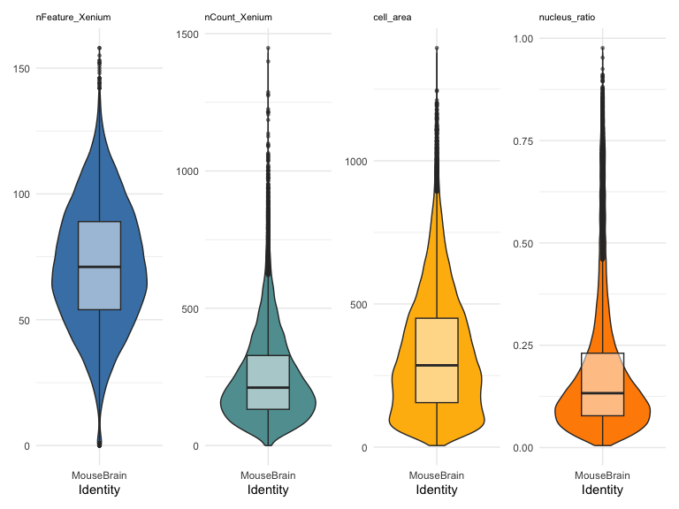<!-- -->

Se fôssemos aplicar o MAD aos violinos das contagens (nFeature_Xenium e
nCount_Xenium), usaríamos o seguinte código:

``` r
# Padrão de tema a ser aplicado aos plots dessa sessão
plot_pattern <- theme_set(
  theme_minimal() +
    theme(
      plot.title  = element_text(size = 10),
      axis.text.x = element_text(angle = 0, hjust = 0.5),
      axis.title.x = element_blank()
    )
)


# Gráfico 9: Total de transcritos por célula com linhas de limite
p9 <- p5 +
  geom_hline(yintercept = upper_nFeature,
             linetype = "dashed",
             color = "blue") +
  geom_hline(yintercept = 10,  # Escolhido com base no violin
             linetype = "dashed", color = "red")

# Gráfico 10: Transcritos únicos por célula com linhas de limite
p10 <- p6 +
  geom_hline(yintercept = upper_nCount, linetype = "dashed", color = "blue") +
  geom_hline(yintercept = 10, linetype = "dashed", color = "red")

# Exibe os dois últimos gráficos
p9 + p10 + plot_layout(ncol = 2)
```

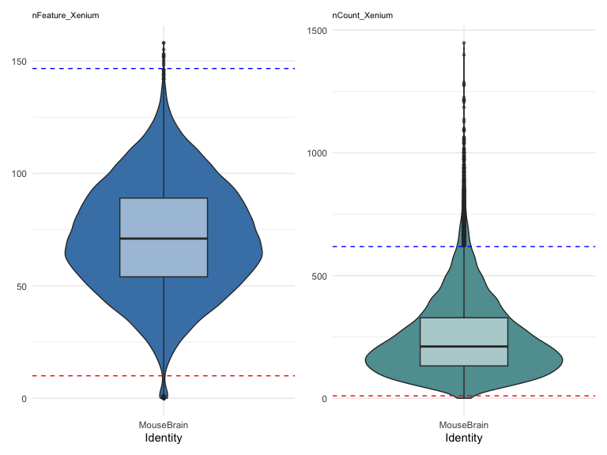<!-- -->

Que tem resultados próximos, mas não idênticos aos “outliers”
identificados (bolinhas vistas nos limites superior e inferior dos
gráficos)

Para gerar o plot do total de transcritos.

``` r
# Gráfico 11: Total de transcritos vistos espacialmente usando cutoff 95th percentil
p11 <- ImageFeaturePlot(xenium.obj, fov = "fov",
                        features = c("nCount_Xenium"),
                        max.cutoff="q95")

# Exibe
p11
```

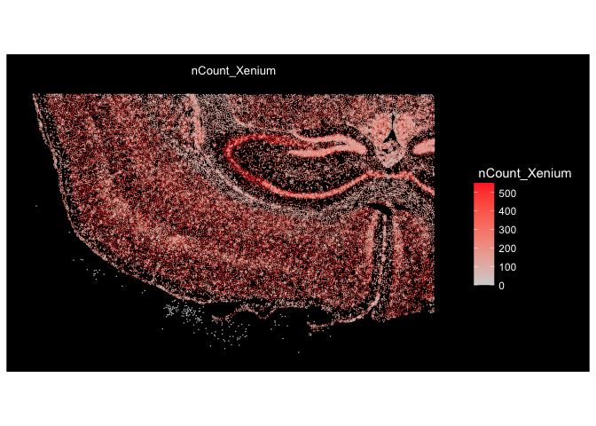<!-- -->

# 4. Pré-processamento: Filtro

Com base nas análises exploratórias, vamos realizar os primeiros filtros
de qualidade.

``` r
# Número de células antes de filtrar
num_cells_before <- ncol(xenium.obj)

# Filtra genes expressos em pelo menos 5 células. Pode ser ajustado
xenium.obj <- subset(xenium.obj,
                     subset = nFeature_Xenium >= 5 & 
                       nFeature_Xenium <= upper_nFeature) %>%
  suppressWarnings()

# Número de células após filtragem de nFeature_Xenium
num_cells_after_feat <- ncol(xenium.obj)   


# Filtrar células com pelo menos 25 contagens. Pode ser ajustado
xenium.obj <- subset(xenium.obj,
                     subset = nCount_Xenium >= 25 &
                       nCount_Xenium <= upper_nCount) %>%
  suppressWarnings()

# Número de células após a filtragem
num_cells_after <- ncol(xenium.obj)

# Exibe a redução
cat(sprintf("Células antes: %d | Células após: %d | Células removidas: %d\n",
            num_cells_before, num_cells_after, (num_cells_before - num_cells_after)))
```

    ## Células antes: 36602 | Células após: 35235 | Células removidas: 1367

Para escolher uma região de interesse (ROI), podemos usar uma filtragem
por coordenadas ou visual.<br> Ao realizar a escolha visual, você verá
um pop-up em que deverá selecionar a área de interesse.

``` r
# ID das células que passaram pelo filtro de contagem
remaining_seurat_ids <- colnames(xenium.obj)

# Filtragem por coordenadas
roi_cells <- cells_info %>%
  filter(x_centroid >= 2000 & x_centroid <= 4000) %>%
  filter(y_centroid >= 1500 & y_centroid <= 2500) %>%
  filter(cell_id %in% remaining_seurat_ids)

# Subset do objeto xenium.obj a partir das coordenadas das células
xenium.coord <- subset(xenium.obj, cells = roi_cells$cell_id)

# Seleção Visual (Laço Interativo)
selected_cell_ids <- InteractiveSpatialPlot(object = xenium.obj,
                                            overlay_image = FALSE) %>% 
  suppressWarnings()

# Subset do objeto xenium.obj a partir das IDs das células
xenium.roi <- subset(xenium.obj,
                     cells = selected_cell_ids) %>% 
  suppressWarnings()
```

# 5. Processamento

Se você escolheu uma região de interesse na etapa anterior, as análises
abaixo serão feitas com o respectivo nome do objeto utilizado. Ajuste se
necessário.

## 5.1 Normalização

A normalização e escalonamento dos dados é etapa mandatório antes de
qualquer redução de dimensionalidade.

``` r
# Salva log(counts + 1) por célula antes do SCT
counts_raw <- GetAssayData(xenium.obj, assay = "Xenium", layer = "counts")
expr_before <- log1p(Matrix::colSums(counts_raw))   # total de transcritos por célula (log)

# SCTransform
xenium.obj <- SCTransform(object = xenium.obj,
                          assay = "Xenium")

# Pega os resíduos de Pearson (output principal do SCT) por célula
sct_data   <- GetAssayData(xenium.obj, 
                           assay = "SCT", 
                           layer = "scale.data")
expr_after <- Matrix::colMeans(sct_data)            # média dos resíduos por célula
```

Verificamos agora a transformação (essa etapa foi incluída apenas para
que você entenda a importância de normalizar/escalonar os dados).

``` r
# Monta df antes e após SCTransform
df_before <- data.frame(valor = expr_before)
df_after  <- data.frame(valor = expr_after)

# Gráfico 13: Plot das contagens antes da normalização
p13 <- ggplot(df_before, aes(x = valor)) +
    geom_density(fill = "tomato", color = "tomato", alpha = 0.4, linewidth = 0.8) +
    labs(
        title = "Antes do SCTransform (log counts)",
        x     = "log(total counts + 1)",
        y     = "Densidade"
    ) +
    plot_pattern +
    theme(legend.position = "none")

# Gráfico 14: Plot das contagens após a normalização
p14 <- ggplot(df_after, aes(x = valor)) +
    geom_density(fill = "steelblue", color = "steelblue", alpha = 0.4, linewidth = 0.8) +
    labs(
        title = "Após SCTransform (resíduos de Pearson)",
        x     = "Média dos resíduos por célula",
        y     = "Densidade"
    ) +
    plot_pattern +
    theme(legend.position = "none")

# Exibe 
p13 + p14 + plot_layout(ncol = 2)
```

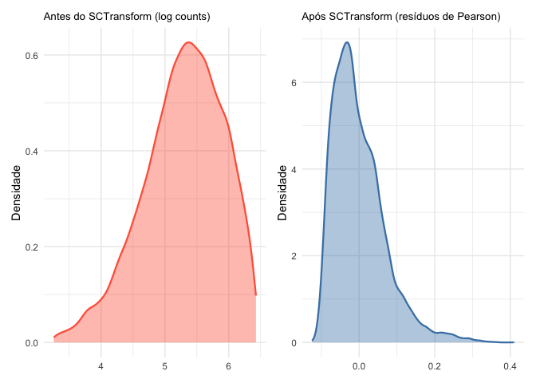<!-- -->

**SCTransform()** é uma das formas de normalizar dados que utiliza
Modelos Lineares Generalizados (GLMs) de distribuição Binomial
Negativa.<br> Essa distribuição **assume que a variância é maior que a
média**, por isso é muito utilizada em dados de RNAseq, incluindo
Spatial Transcriptomics. Assim, a função modela a contagem esperada de
cada gene com base na profundidade de sequenciamento da célula e no
nível geral de expressão do gene.<br> Para cada gene, obtemos uma
estimativa de **“expressão real”** — trata-se de um valor corrigido de
expressão gênica que leva em conta fatores como a profundidade de
sequenciamento da célula, o nível geral de expressão do gene e fatores
técnicos específicos do gene.<br>

Além disso, essa função funciona como um comando unificado que substitui
as seguintes funções:

- NormalizeData(): Função de normalização. Divide as contagens de
  características (genes) pelas contagens totais de cada célula,
  multiplica por um fator de escala (padrão: 10.000) e aplica uma
  transformação de logaritmo natural *ln(x + 1)*;
- FindVariableFeatures(): Identifica genes com alta variação entre
  células analisando a relação média-variância nos dados normalizados
  por logaritmo;
- ScaleData(): Ajusta a média da expressão gênica para 0 e a variância
  para 1 entre as células, evitando que genes de alta expressão dominem
  os resultados.

## 5.2 Redução de dimensionalidade

Após a normalização dos dados, vamos reduzir sua dimensionalidade
através das técnicas de PCA e UMAP.

### 5.2.1 Principal Component Analysis (PCA)

- Genes altamente expressos exibem naturalmente uma variância muito
  maior do que genes com baixa expressão, unicamente devido ao
  escalonamento técnico;
- Então usamos PCA após a transformação dos dados pois se o aplicássemos
  diretamente aos dados brutos, os primeiros componentes principais
  refletiriam simplesmente a profundidade de sequenciamento e os genes
  altamente expressos, mascarando as verdadeiras estruturas biológicas
  subjacentes;
- O PCA é calculado com um maior número de dimensões (15-30) antes do
  UMAP para tornar a computação mais rápida;
- Depois disso, verificamos a quantidade de PCs mediante ElbowPlot, no
  ponto onde acontece o “cotovelo”, ou numericamente para as análises
  subsequentes.<br> Calma que você já vai entender!

``` r
# Componentes Principais (PCA)
xenium.obj <- RunPCA(object = xenium.obj,
                     npcs = 30,           # PCA com 30 dimensões
                     features = rownames(xenium.obj))
```

Vamos verificar visualmente através do ElbowPlot:

``` r
# Verificação visual (ElbowPlot)
ElbowPlot(object = xenium.obj,
          ndims = 30)             # Mesmo número de dimensões do PCA
```

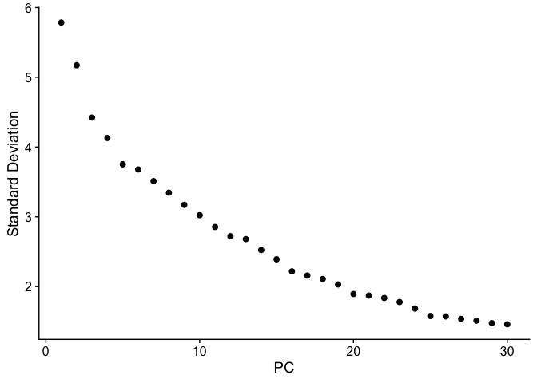<!-- -->

Às vezes pode ser difícil identificar o número de dimensões (PCs) com
base no plot pois isso pode um pouco subjetivo.<br> Para facilitar,
vamos identificá-los numericamente

``` r
# Determine o % de variação associado a cada PC
pct <- xenium.obj[["pca"]]@stdev / sum(xenium.obj[["pca"]]@stdev) * 100

# Calcule o % cumulativo de cada PC
cumu <- cumsum(pct)

# Determine qual componente principal (PC) apresenta uma porcentagem acumulada superior a 90% e uma porcentagem de variação associada inferior a 5.
co1 <- which(cumu > 90 & pct < 5)[1]

# Exibe
co1
```

    ## [1] 25

``` r
# Determine a diferença entre a variação do PC e o PC subsequente
co2 <- sort(which((pct[1:length(pct) - 1] - pct[2:length(pct)]) > 0.1), decreasing = T)[1] + 1

# Último ponto onde a mudança na % de variação é superior a 0,1%
co2
```

    ## [1] 25

``` r
# Determine o mínimo dos dois cálculos
pcs <- min(co1, co2)

# Exibe
pcs
```

    ## [1] 25

Perceba que pelo ElbowPlot, parece que as 25 primeiras componentes
principais são suficientes para explicar a maior parte da variação dos
dados. <br> No entanto, tivemos certeza a partir dos valores de “pcs”.
Aqui, tanto *co1* quanto *co2* tiveram o mesmo valor. Isso não ocorre
sempre.

### 5.2.2 Uniform Manifold Approximation and Projection (UMAP)

- O UMAP preserva as relações locais (pontos de dados próximos
  permanecem próximos) e mantém melhor a estrutura global dos dados do
  que ferramentas mais antigas, como o t-SNE.

``` r
xenium.obj <- RunUMAP(object = xenium.obj,
# Ajustamos o valor de dims de acordo com o PCA ou Elbow/Numericamente
                      dims = 1:pcs,      
                      verbose = FALSE)
```

## 5.3. Vizinhos

Vamos identificar tipos celulares ou estados transcricionalmente
distintos. Os dados do Xenium capturam a expressão gênica direcionada em
nível de célula única real e com alta resolução. Ao construir um grafo
de Vizinhos Mais Próximos Compartilhados (SNN) com base na expressão, a
função **FindNeighbors()** prepara os dados para a “FindClusters”,
permitindo classificar as células (por exemplo, células T, neurônios,
células tumorais) independentemente de sua localização no tecido.

``` r
# Encontrando vizinhos mais próximos️
xenium.obj <- FindNeighbors(object = xenium.obj,
                            reduction = "pca",
                            dims = 1:pcs)        # Vizinho com base em PCA
```

## 5.4. Clusterização

Queremos identificar os clusters no nosso dataset usando a função
“FindClusters()”. Um dos parâmetros dessa função é a resolução
(resolution), que controla a granularidade matemática da detecção de
comunidades no grafo.

- Valores mais **altos** de resolução separam subpopulações;
- Valores mais **baixos** de resolução capturam melhor os linhagens
  principais.

Em geral, para paineis Xenium, a resolução fica entre 0.2 e 0.4. No
entanto, escolher apenas pelo número pode não refletir a biologia e para
ter certeza é importante verificar se as informações biológicas (genes
que diferenciam um cluster do outro na resolução escolhida) fazem
sentido.<br>

Vamos aprender um pouco sobre como escolher numericamente o valor de
resolução.

``` r
# Teste múltiplas resoluções
resols <- c(0.1, 0.2, 0.3, 0.4, 0.5, 0.6, 0.7, 0.8)

for (res in resols) {
  xenium.obj <- FindClusters(object = xenium.obj, 
                             resolution = res,
                             # Algoritmo de Leiden = 4. Louvain = 1 (padrão da função)  
                             algorithm = 4,
                             random.seed = 45
                             )
}

# Nomes reais das colunas geradas
cols_res <- paste0("SCT_snn_res.", resols)

# Confere se as colunas de cada resolução foram criadas corretamente
colnames(xenium.obj@meta.data)[grep("snn_res", colnames(xenium.obj@meta.data))]
```

    ## [1] "SCT_snn_res.0.1" "SCT_snn_res.0.2" "SCT_snn_res.0.3" "SCT_snn_res.0.4" "SCT_snn_res.0.5"
    ## [6] "SCT_snn_res.0.6" "SCT_snn_res.0.7" "SCT_snn_res.0.8"

``` r
# Gráfico 15: Clustree
p15 <- clustree(
    x = xenium.obj@meta.data[, cols_res, drop = FALSE], 
    prefix = "SCT_snn_res.", 
    show_axis = TRUE, 
    node_colour = "sc3_stability",
    node_text_size = 3,       # Reduz o tamanho do texto interno das bolinhas
    node_size_range = c(3,7)  # Ajusta o diâmetro mínimo e máximo dos círculos
    ) +
  scale_color_gradient(low = "lightyellow", high = "steelblue")

# Exibe
p15
```

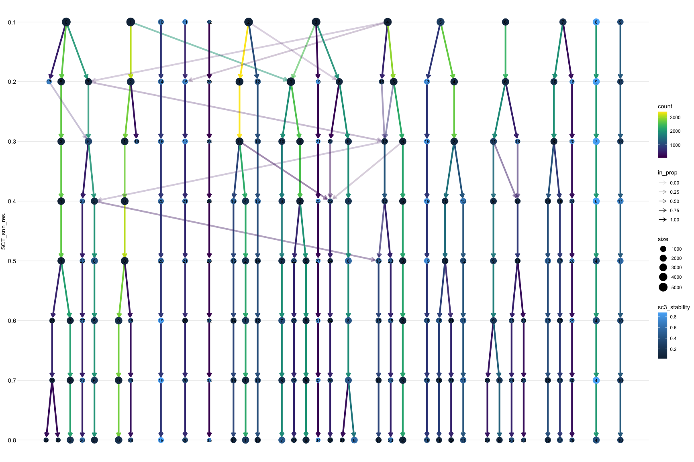

``` r
# Grafo em vez do plot
tree_graph <- clustree(xenium.obj@meta.data[, cols_res, drop = FALSE],
                       prefix = "SCT_snn_res.",
                       return = "graph")

# Extraia os atributos de cada nó (inclui sc3_stability calculado internamente)
node_data <- igraph::as_data_frame(tree_graph,
                                   what = "vertices")

# Confira os nomes das colunas disponíveis
colnames(node_data)
```

    ## [1] "node"          "SCT_snn_res."  "cluster"       "size"          "sc3_stability"

``` r
# Escolha o nó mais estável (maior valor de estabilidade média)
stable_node <- node_data %>%
  group_by(SCT_snn_res.) %>%   # ajuste esse nome conforme o que aparecer no colnames() acima
  summarise(estabilidade_media = mean(sc3_stability, na.rm = TRUE)) %>%
  arrange(desc(estabilidade_media))

# Exibe
stable_node
```

    ## # A tibble: 8 × 2
    ##   SCT_snn_res. estabilidade_media
    ##   <fct>                     <dbl>
    ## 1 0.3                       0.374
    ## 2 0.2                       0.370
    ## 3 0.6                       0.360
    ## 4 0.4                       0.358
    ## 5 0.7                       0.348
    ## 6 0.1                       0.326
    ## 7 0.8                       0.321
    ## 8 0.5                       0.312

O que isso sugere na prática:

Vimos que alguns resultados estão bem próximos, ao passo que a resolução
0.5 está bem diferente dos demais. Assim, precisamos saber que devemos
saber que **o melhor critério de desempate é biológico (e não apenas
meramente numérico/estatístico)**. E isso é feito identificando a
resolução que melhor separa os tipos celulares que esperados nesse
tecido (usando FeaturePlot()/VlnPlot() dos marcadores conhecidos), e
qual delas mostra coerência espacial mais clara no ImageDimPlot().

Não vamos fazer isso nesse tutorial. No caso, definimos a resolução de
0.5 (porque é a menor resolução com divisão entre clusters –\> apenas o
cluster 12 se dividiu).

``` r
xenium.obj <- FindClusters(object = xenium.obj,
                           resolution = 0.5,  # Clusters com resolução de 0.5
                           algorithm = 4,
                           random.seed = 45
                           )  
```

Vamos plotar

``` r
# Gráfico 16: UMAP da clusterização na resolução 0.5
p16 <- DimPlot(object = xenium.obj,
        label = TRUE,
        label.box = TRUE,
        pt.size = 0.2,
        cols = 'polychrome',
        reduction = "umap"
        ) +
  NoAxes()

# Exibe
cat("Gráfico 16: UMAP da clusterização na resolução 0.5")
```

    ## Gráfico 16: UMAP da clusterização na resolução 0.5

``` r
p16
```

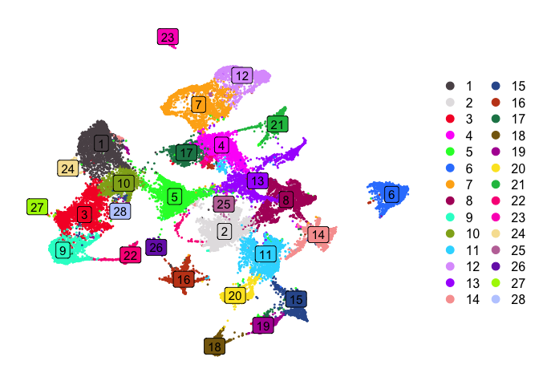<!-- -->

# 6. Visualização Espacial e Marcadores

## 6.1 Visualização espacial

O plot p16 da sessão anterior nos mostra que na resolução de 0.5, foram
encontrados 20 clusters celulares. Algumas células do cluster 5, por
exemplo, estão próximas do cluster 3.<br> O cluster 2 também está
dividido em duas regiões distintas no gráfico.<br> Para definir quais
clusters permanecerão, é preciso avaliar espacialmente os marcadores de
cada cluster e anotar os clusters adequadamente. Vamos mostrar um pouco,
mas isso é realizado até o encontro da resolução ideal.

``` r
# Gráfico 17: Features de interesse (transcritos) no UMAP
p17 <- FeaturePlot(object = xenium.obj,
                  features = c("Cux2", "Gad1", "Slc17a7", "Sst"),
                  reduction = "umap") &
  NoAxes()

# Gráfico 18: Distribuição espacial dos genes no tecido
p18 <- ImageDimPlot(xenium.obj,
                    cols = "polychrome",
                    size = 0.75)

# Gráfico 19: Distribuição do gene "Slc17a7" no tecido
p19 <- ImageFeaturePlot(xenium.obj,
                        features = "Slc17a7",
                        axes = TRUE,
                        max.cutoff = "q90")

# Exibição dos gráficos
cat("Gráfico 17: Features de interesse (transcritos) no UMAP")
```

    ## Gráfico 17: Features de interesse (transcritos) no UMAP

``` r
p17
```

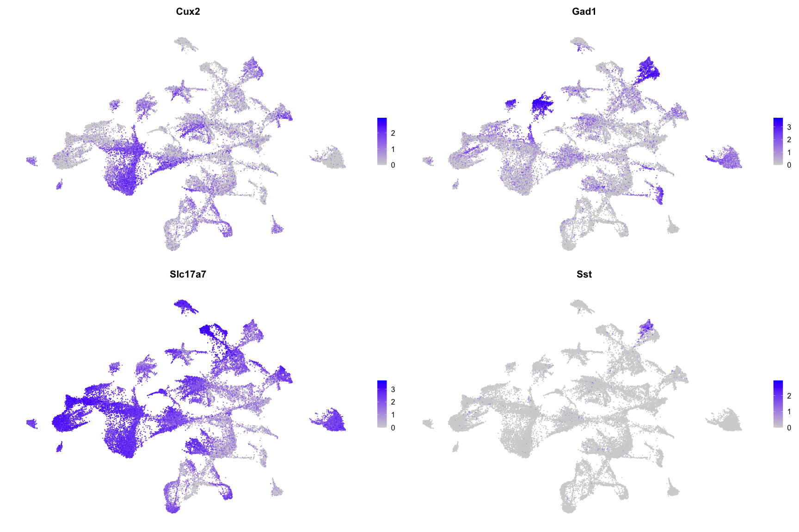

``` r
cat("Gráfico 18: Distribuição espacial dos genes no tecido")
```

    ## Gráfico 18: Distribuição espacial dos genes no tecido

``` r
p18
```

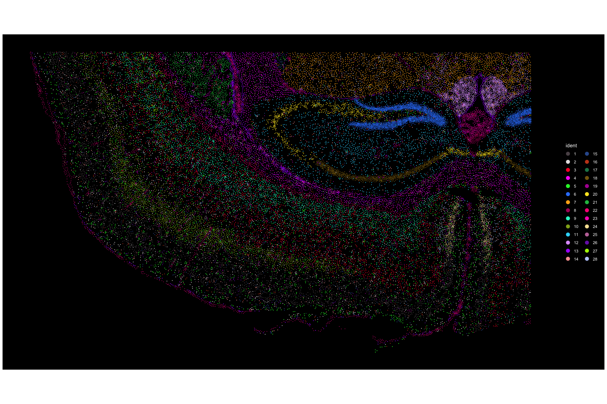

``` r
cat("Gráfico 19: Distribuição do gene 'Scl17a7' no tecido")
```

    ## Gráfico 19: Distribuição do gene 'Scl17a7' no tecido

``` r
p19
```

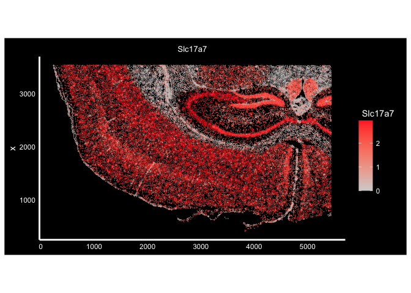

## 6.2 Marcadores

Genes marcadores por cluster a partir da função FildAllMarkers() do
Seurat.<br> Perceba que aqui:

- only.pos = TRUE: retorna somente marcadores positivos;
- min.pct = 0.05: genes expressos em pelo menos 5% das células de
  qualquer uma das populações celulares comparadas;
- logfc.threshold = 1: reporta pelo menos 2 fold de diferença.

``` r
# FindAllMarkers
all.markers <- FindAllMarkers(xenium.obj, only.pos = TRUE,
                              min.pct = 0.05, logfc.threshold = 1)

# Salva a tabela gerada
write.table(all.markers, "marker_genes_clusters.csv",
            col.names=TRUE, row.names=FALSE, quote=FALSE, sep=",")
```

Para conferir os marcadores de uma forma mais objetiva, podemos gerar os
plots de violino, usando os genes que resultaram da tabela anterior.
Para isso, vamos apresentar com o gene “Bdnf”, que foi um dos genes
específicos do cluster 0:

``` r
# Gráfico 20: Violin Plot do gene "Bdnf" por cluster
p20 <- VlnPlot(object = xenium.obj,
        features = "Bdnf",
        layer="data",
        pt.size = 0,
        cols = DiscretePalette(n = length(levels(xenium.obj)),
                               palette = "polychrome")) +
  theme(axis.text.x = element_text(angle = 0, 
                                   hjust = 0.5, 
                                   vjust = 1, 
                                   size = 7))


# Outro marcador
p21 <- VlnPlot(object = xenium.obj,
        features = "Cd53",
        layer="data",
        pt.size = 0,
        cols = DiscretePalette(n = length(levels(xenium.obj)),
                               palette = "polychrome")) +
  theme(axis.text.x = element_text(angle = 0, 
                                   hjust = 0.5, 
                                   vjust = 1, 
                                   size = 7))

# Exibe
p20 / p21 +
    plot_layout(guides = "collect") &
    theme(legend.position = "right")
```

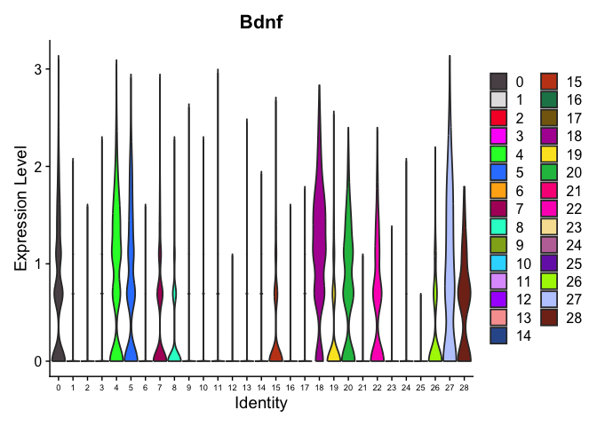<!-- -->

Um gene por si só não faz milagre! Então, você deve cruzar esse
resultado com outros marcadores, para confirmar ou refinar essa hipótese
antes de atribuir um rótulo definitivo a cada cluster. Isso se chama
**anotação**.

# 7. Informações Adicionais

- Em projetos reais (principalmente com paineis maiores, tecidos mais
  heterogêneos, ou preocupação com erros de segmentação), ferramentas de
  anotação por referência como RCTD ou label transfer do Seurat são o
  padrão usado na literatura. Podemos conversar sobre eles depois.
- Após a anotação dos clusters, é importante analisar as vias
  envolvidas, colocalização de clusters para identificar interações
  entre eles e de fato tornar as análises biologicamente relevantes.
- Essa etapa não foi incluída porque se trata de uma introdução. Logo,
  tenha em mente que não acabou por aqui.

# 8. Referências

- GitHub Pedro Videira Pinho:
  <https://github.com/pedrovp161/spatialCourse>
- Material **IV WORKSHOP LBBC - 2025**, incluindo slides e Google Colab
  dos alunos: Cristóvão de Lanna, Ph.D.; Gabriela Rapozo, M.Sc.; Gabriel
  Fonseca, M.Sc.; Ana Carolina, M.Sc; Pedro Pinho, B.Sc.
- Tutoriais e outros materiais 10x: <https://www.10xgenomics.com/> ,
  <https://www.10xgenomics.com/analysis-guides/xenium-downstream-analysis-in-r-tutorial>
- BioStatSquid: <https://biostatsquid.com/>
- Satija Lab:
  <https://satijalab.org/seurat/articles/seurat5_spatial_vignette_2>
- StatQuest:
